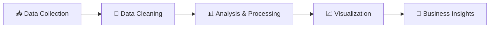

<div align="center">

# 💻 IT Market Analysis Dashboard

### Strategic Intelligence for Indonesian IT Job Market

[](https://it-market-analysis-dashboard1.streamlit.app/)
[](https://github.com/habstrakT808/it-market-analysis-dashboard/stargazers)
[](https://github.com/habstrakT808/it-market-analysis-dashboard/network)


---

### 🚀 [**View Live Dashboard**](https://it-market-analysis-dashboard1.streamlit.app/) 🚀

---

</div>

## 📊 Project Overview

An **interactive data analytics dashboard** that provides comprehensive insights into the Indonesian IT job market. This project demonstrates advanced data analysis capabilities, strategic business intelligence, and modern web application development using Python and Streamlit.

Built to support **data-driven decision making** for IT companies, recruitment agencies, and technology professionals seeking market intelligence.

## ✨ Key Features

<table>
<tr>
<td width="50%">

### 📈 **Market Analytics**
- **752 Job Records** analyzed
- **2,754 Technology Trends** tracked
- **Real-time Filtering** capabilities
- **Interactive Visualizations**

</td>
<td width="50%">

### 🎯 **Business Intelligence**
- **Salary Benchmarking** by experience
- **Geographic Market Analysis**
- **Technology Demand Insights**
- **Strategic Recommendations**

</td>
</tr>
</table>

## 🎨 Dashboard Sections

| Section | Description | Key Insights |
|---------|-------------|--------------|
| 📊 **Market Overview** | High-level KPIs and market trends | Total jobs, average salary, company distribution |
| 💰 **Salary Analysis** | Comprehensive compensation insights | Salary ranges by experience and location |
| 🔧 **Skills Demand** | Technology and programming trends | Most in-demand skills and frameworks |
| 📍 **Geographic Analysis** | Regional market distribution | Location-based opportunities and remote work trends |
| 🎯 **Business Insights** | Strategic recommendations | Actionable intelligence for business growth |

## 🛠️ Technology Stack

<div align="center">


</div>

### Core Technologies
- **🐍 Python**: Data processing and analysis
- **📊 Streamlit**: Interactive web dashboard framework
- **📈 Plotly**: Advanced data visualization library
- **🐼 Pandas**: Data manipulation and analysis
- **🔢 NumPy**: Numerical computing
- **🌐 BeautifulSoup**: Ethical web scraping
- **📊 Seaborn & Matplotlib**: Statistical visualization

## 🚀 Quick Start

### 🌐 Online Access
**[Launch Dashboard →](https://it-market-analysis-dashboard1.streamlit.app/)**

No installation required! Access the full-featured dashboard directly in your browser.

### 💻 Local Installation

```bash
# Clone the repository
git clone https://github.com/habstrakT808/it-market-analysis-dashboard.git
cd it-market-analysis-dashboard

# Install dependencies
pip install -r requirements.txt

# Run the dashboard
streamlit run app.py
```

## 📈 Key Market Insights

<div align="center">

 Metric  Value  Insight  📊 **Total Jobs Analyzed**  752  Comprehensive market coverage  💰 **Average Salary**  Rp 12.8M/month  Competitive IT market  🏢 **Active Companies**  22+  Diverse hiring landscape  🌐 **Remote Opportunities**  57.4%  Strong remote work adoption  📍 **Geographic Coverage**  15+ cities  National market analysis 

</div>

### 🎯 Strategic Findings

- **🚀 Market Opportunity**: Lampung region shows significant untapped potential
- **💡 Technology Trends**: JavaScript, Python, and React dominate market demand
- **💰 Salary Growth**: 200-300% increase from Junior to Senior levels
- **🌐 Remote Revolution**: Majority of positions offer flexible work arrangements
- **📊 Skill Premium**: Modern frameworks command higher compensation

## 🏗️ Project Architecture

```javascript
it-market-analysis-dashboard/
├── 📱 app.py                          # Main Streamlit application
├── 📋 requirements.txt                # Python dependencies
├── 📖 README.md                       # Project documentation
├── 📁 src/
│   ├── 🎨 dashboard_fixed.py          # Core dashboard logic
│   ├── 📊 data_collection.py          # Data acquisition pipeline
│   └── 🧹 data_cleaning.py            # Data preprocessing utilities
├── 📁 data/
│   ├── 📁 processed/                  # Clean, analysis-ready datasets
│   │   ├── 💼 it_jobs_cleaned.csv     # Job market data
│   │   ├── 🔧 tech_trends_cleaned.csv # Technology trends
│   │   └── 📊 data_quality_report.json# Data quality metrics
│   └── 📁 raw/                        # Original data sources
├── 📁 notebooks/                      # Jupyter analysis notebooks
└── 📁 scripts/                        # Utility and automation scripts
```

## 🔍 Data Pipeline

<div align="center">



</div>

1. **📥 Collection**: Hybrid approach combining public datasets and ethical scraping
2. **🧹 Cleaning**: Comprehensive validation, standardization, and quality assurance
3. **📊 Analysis**: Statistical analysis, trend identification, and pattern recognition
4. **📈 Visualization**: Interactive charts, dashboards, and business intelligence
5. **🎯 Insights**: Strategic recommendations and actionable business intelligence

## 🎯 Business Impact

### For IT Companies

- ✅ **Market Positioning**: Understand competitive landscape
- ✅ **Technology Strategy**: Identify high-demand skills for investment
- ✅ **Talent Acquisition**: Benchmark compensation and hiring strategies
- ✅ **Geographic Expansion**: Discover untapped regional markets

### For Professionals

- ✅ **Career Planning**: Understand salary expectations and growth paths
- ✅ **Skill Development**: Focus on in-demand technologies
- ✅ **Market Awareness**: Stay informed about industry trends
- ✅ **Negotiation Power**: Leverage market data for career advancement

## 🌟 Demo Screenshots

<div align="center">

### 📊 Market Overview Dashboard

*Comprehensive KPIs and market trends at a glance*

### 💰 Salary Analysis Interface

*Interactive compensation analysis by experience and location*

### 🔧 Skills Demand Visualization

*Technology trends and programming language popularity*

### 🎯 Business Intelligence Panel

*Strategic insights and actionable recommendations*

</div>

## 🤝 Contributing

We welcome contributions! Here's how you can help:

1. **🍴 Fork** the repository
2. **🌿 Create** a feature branch (`git checkout -b feature/amazing-feature`)
3. **💾 Commit** your changes (`git commit -m 'Add amazing feature'`)
4. **📤 Push** to the branch (`git push origin feature/amazing-feature`)
5. **🔄 Open** a Pull Request

### 💡 Contribution Ideas

- 📊 Additional data sources integration
- 🎨 UI/UX improvements
- 📈 New analysis features
- 🌐 Multi-language support
- 📱 Mobile optimization

## 📄 License

This project is licensed under the **MIT License** - see the [LICENSE](LICENSE) file for details.

## 🙏 Acknowledgments

- **📊 Stack Overflow** - Developer survey data and community insights
- **🇮🇩 Indonesian IT Community** - Market validation and feedback
- **🏢 Newus Technology** - Strategic context and business inspiration
- **🌟 Open Source Community** - Tools and libraries that made this possible

## 📞 Connect & Support

<div align="center">

[](https://www.linkedin.com/in/habstrakt808/)
[](https://github.com/habstrakT808)
[](mailto:jhodywiraputra@gmail.com)

### ⭐ Star this repository if you found it helpful!

</div>


<div align="center">

### 🚀 [**Experience the Dashboard Live**](https://it-market-analysis-dashboard1.streamlit.app/) 🚀

**"Empowering Strategic Decisions with Data Intelligence"**

*Built with ❤️ for the Indonesian IT Ecosystem*


</div>
